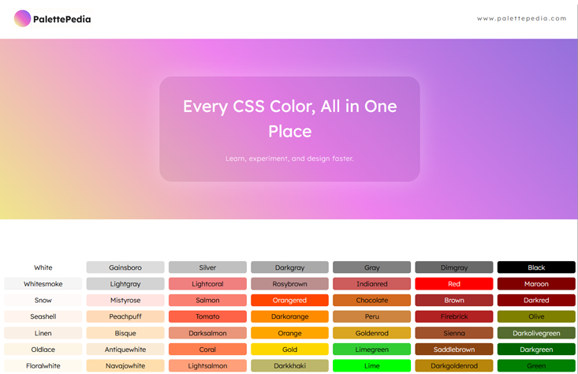

# PalettePedia

PalettePedia is a small front-end project built as part of the Codecademy Full-Stack Engineer career path. The goal of the exercise was to create a cheatsheet for a concept I had learned, and I chose to build a CSS color cheatsheet where users can view all the named CSS colors, see each color name directly on its cell, and copy a color name by clicking the cell so it is ready to paste into a project.

## What I Practiced

- Planning and designing the layout before implementing it
- Using HTML tables to organize content
- Styling the project with CSS
- Building a responsive layout for different screen sizes
- Adding JavaScript to support copy-and-paste functionality

## Built With

- HTML
- CSS
- JavaScript

## Future Improvements

- Add an option to select one color for the background and another for the foreground
- Let users preview color combinations and show whether the contrast passes or fails for readability
